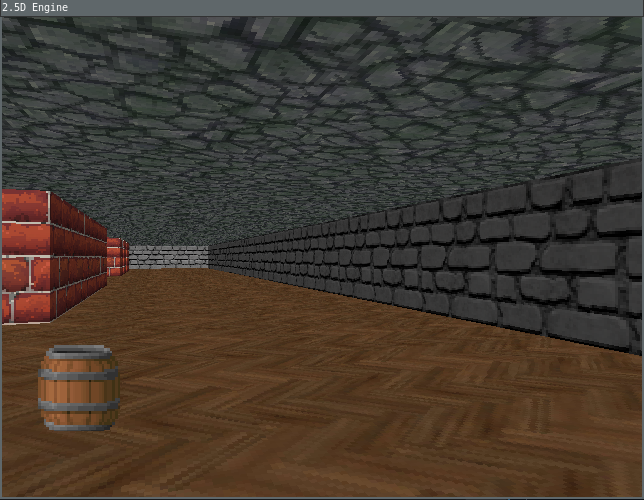

# 2.5D Raycasting Engine (C++/SDL2)

A simple Wolfenstein 3D–style 2.5D engine written from scratch in modern C++ using SDL2. The project is part of my personal learning journey to understand game engine internals, graphics programming, and low-level systems.

## Features
- Pure CPU-based renderer
- Raycasting using DDA algorithm (like the original Wolfenstein 3D)
- Textured walls, floor, ceiling and sprites rendering
- Fixed timestep game loop with frame timing and FPS counter
- Mouse (rotation, shot) and keyboard (WASD) control
- Entity hierarchy (pickups, interactive, solid etc.)
- Basic colision detection with walls and solid entities
- Shooting, destroying objects (without animation for now), health pickups
- Basic HUD with ammo and health info

Built as a foundation for future experiments:
- networking
- lighting and shading experiments

## Project Structure
    /root
    └── /Engine               
        └── CmakeLists.txt
        └── /include/Engine       
            ├── Assets.h
            ├── Engine.h           
            ├── ...
            └── Texture.h        
        └── /src                 
            ├── Assets.cpp
            ├── Engine.cpp           
            ├── ...
            └── Texture.cpp   
    └── /Game
        └── CmakeLists.txt
        └── /include/Game
            ├── Game.h                 
            ├── GameState.h
            ├── ...                
            └── MainMenuState.h
         └── /src                 
            ├── main.cpp
            ├── Game.cpp           
            ├── ...
            └── MainMenuState.cpp
    └── CmakeLists.txt
    └── /Resources
        ├── /fonts   
        ├── /maps
        ├── ...
        └── /textures
        

## Screenshots

For now it looks like this:
 
 

## Future Roadmap

- Enemies
- Dynamic lighting / shading
- Map editor or procedural maps
- Multiplayer experiments (UDP / TCP)
- ECS pattern (overkill for this)

## Credits & Inspiration
- John Carmack – you know him
- Lode Vandevenne – legendary raycasting tutorial. I got whole DDA concept from this source.
- Fabien Sanglard – his blog and "Black books"
