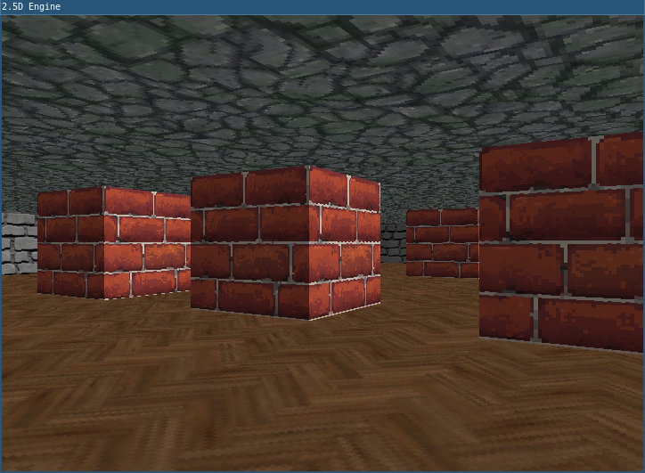
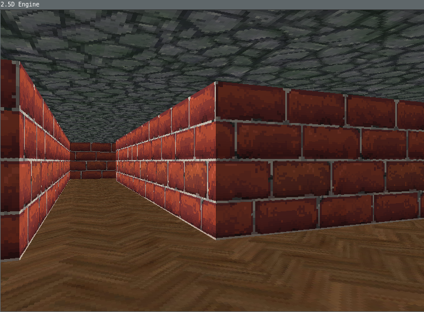

# 2.5D Raycasting Engine (C++/SDL2)

A simple Wolfenstein 3D–style 2.5D engine written from scratch in modern C++ using SDL2. The project is part of my personal learning journey to understand game engine internals, graphics programming, and low-level systems.

## Features
- Pure CPU-based renderer
- Raycasting using DDA algorithm (like the original Wolfenstein 3D)
- Textured walls, floor, ceiling and sprites rendering
- Fixed timestep game loop with frame timing and FPS counter

Built as a foundation for future experiments:
- networking
- lighting and shading experiments

## Project Structure
    /assets
    ├── /maps
    └── /textures
        ├── /wolftex          # Original Wolf3D textures
        └── /textures         # Other textures
    /src    
    ├── main.cpp               # Entry point
    └── /engine 
        ├── Game.h/.cpp        # Game loop, player, world update    
        ├── Map.h              # Map struct
        ├── Player.h           # Player struct 
        ├── Raycaster.h/.cpp   # Raycaster DDA algorithm
        ├── Renderer.h/.cpp    # Framebuffer, SDL integration   
        ├── Sprite.h           # Sprite struct 
        └── Texture.h/.cpp     # Texture loading and access   
        

## Screenshots

For now it looks like this:
 
 

## Future Roadmap

- Enemies, pickups
- Basic collision detection (for now only with walls)
- mouse rotation (for now W, A, S, D)
- Dynamic lighting / shading
- Map editor or procedural maps
- Multiplayer experiments (UDP / TCP)
- ECS pattern

## Credits & Inspiration
- John Carmack – you know him
- Lode Vandevenne – legendary raycasting tutorial. I got whole DDA concept from this source.
- Fabien Sanglard – his blog and "Black books"
